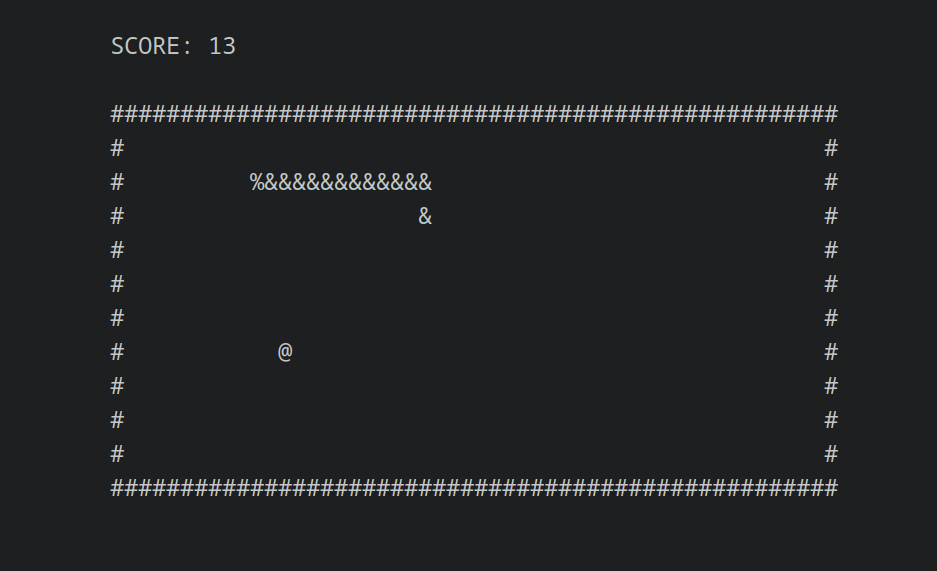

# Terminal Snake



A snake clone initially made for an OOP Assignment at Lodz University of Technology. Made in c++ with ncurses and boost libraries. For Linux only.

> __Disclaimer__: This is not supposed to be the fastest or the smallest snake clone. It is meant to be easily extensible and clear.

Features:
* changing board dimensions and speed
* saving and updating a highscore
* minimal cli interface (-h for help page)
* pausing

### TODO

* color display
* saving and loading game state

### Dependencies

If you are running Debian or Ubuntu, you can install all dependencies with these simple commands on a terminal:

``` bash
# boost:
sudo apt-get install libboost-all-dev

# ncurses:
sudo apt-get install libncurses5-dev libncursesw5-dev
```

There may additionally be a need to install glibc's pthreads library:
``` bash
sudo apt-get install libpthread-stubs0-dev
```

### How to Compile

To compile use cmake either from gui or command line. Once you navigate to the repo's root directory run:

``` bash
    # build
    mkdir build & cmake -B build .

    # compile
    cd build & make

    # if you encounter problems you can just delete the build folder,
    # install missing dependencies and/or troubleshoot and try again.

    # the executable should now be located at repo/build/program/Program
    # execute   v   to print the help page 
    ./program/Program -h
```